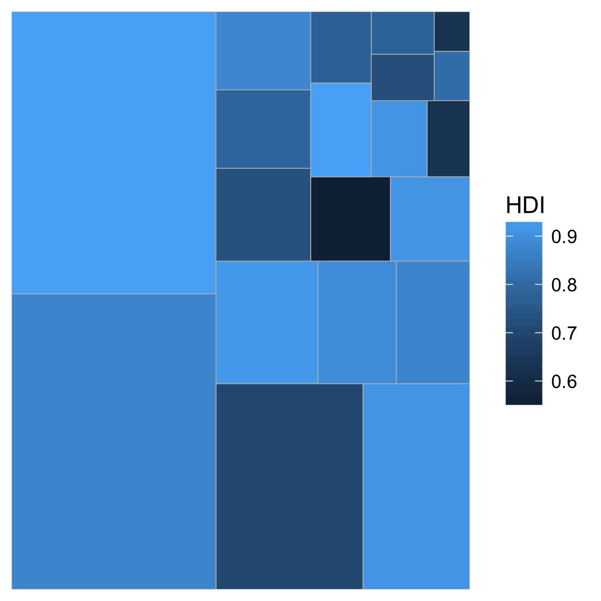
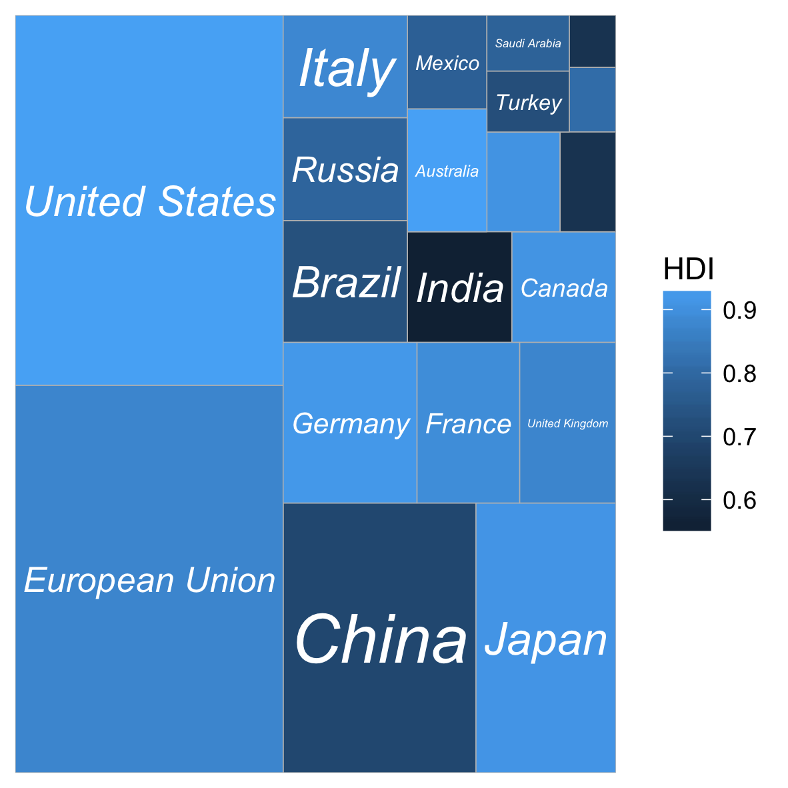
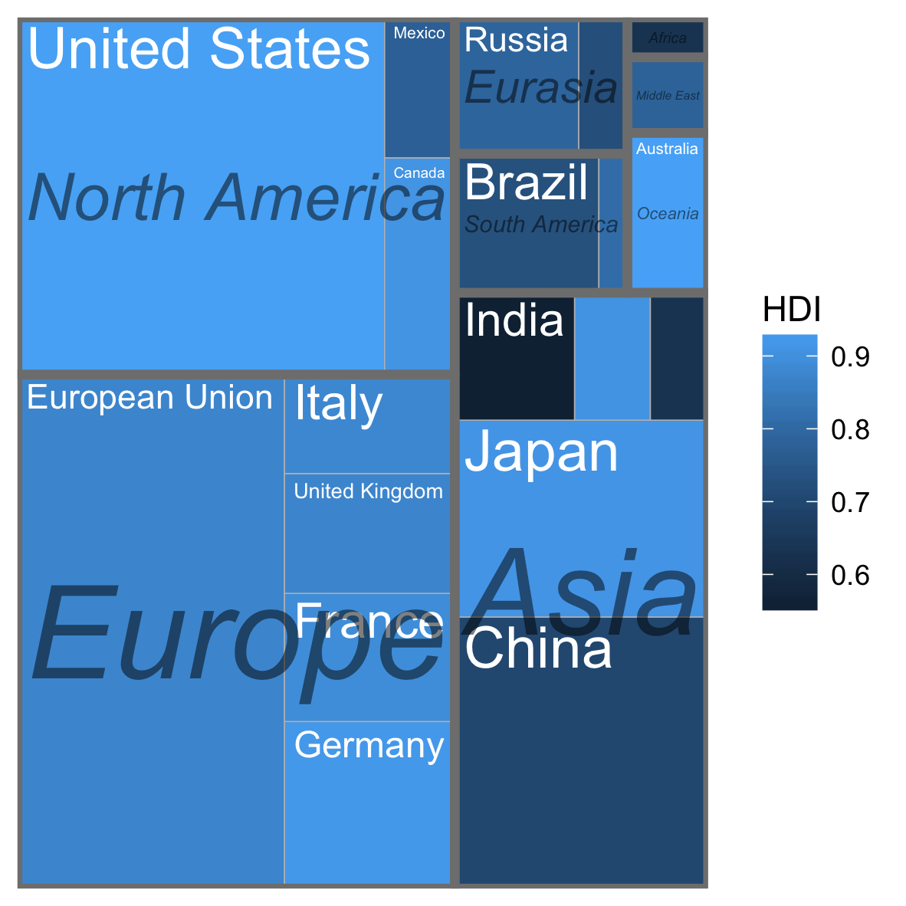
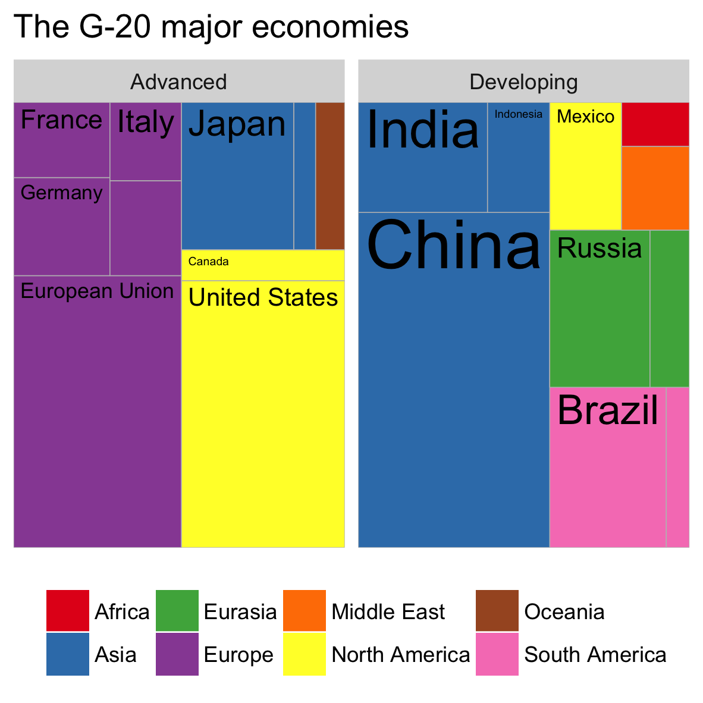

**Treemapify provides ggplot2 geoms for drawing [treemaps](http://en.wikipedia.org/wiki/Treemap)**

# Walkthrough

## Install

Install ggplot2, reshape2, plyr, devtools and ggfittext if you don't have them
already. ggfittext and treemapify are installed from github.

``` r
install.packages("ggplot2")
install.packages("reshape2")
install.packages("plyr")
install.packages("devtools")
library(devtools)
install_github("wilkox/ggfittext")
install_github("wilkox/treemapify")
library(treemapify)
```

## An example dataset

For this example, we'll plot some data on the G-20 group of major world
economies. The `G20` dataset comes with treemapify:

``` r
G20
#>           Region        Country GDP.mil.USD   HDI Econ.classification
#> 1         Africa   South Africa      384315 0.629          Developing
#> 2  North America  United States    15684750 0.937            Advanced
#> 3  North America         Canada     1819081 0.911            Advanced
#> 4  North America         Mexico     1177116 0.775          Developing
#> 5  South America         Brazil     2395968 0.730          Developing
#> 6  South America      Argentina      474954 0.811          Developing
#> 7           Asia          China     8227037 0.699          Developing
#> 8           Asia          Japan     5963969 0.912            Advanced
#> 9           Asia    South Korea     1155872 0.909            Advanced
#> 10          Asia          India     1824832 0.554          Developing
#> 11          Asia      Indonesia      878198 0.629          Developing
#> 12       Eurasia         Russia     2021960 0.788          Developing
#> 13       Eurasia         Turkey      794468 0.722          Developing
#> 14        Europe European Union    16414483 0.876            Advanced
#> 15        Europe        Germany     3400579 0.920            Advanced
#> 16        Europe         France     2608699 0.893            Advanced
#> 17        Europe United Kingdom     2440505 0.875            Advanced
#> 18        Europe          Italy     2014079 0.881            Advanced
#> 19   Middle East   Saudi Arabia      727307 0.782          Developing
#> 20       Oceania      Australia     1541797 0.938            Advanced
```

A treemap draws a tile for each observation, with the area of the tile
proportional to a dataset variable. Let's start by drawing a treemap with each
tile representing a G-20 country, the area of the tile mapped to the country's
GDP, and the tile's fill colour mapped to its HDI. `geom_treemap` is the basic
geom for this purpose.

``` r
ggplot(G20, aes(area = GDP.mil.USD, fill = HDI)) +
  geom_treemap()
```



This plot isn't very useful without the knowing what country is represented by
each tile. We can add text labels to the tiles with `geom_treemap_text`. This
uses the (ggfittext)[https://github/wilkox/ggfittext] package to resize the text
to fit each tile. In addition to standard text formatting parameters as you
would use in `geom_text`, we can pass parameters for `ggfittext`; for example,
we can place the text in the centre of the tile, and expand it to fill as much
of the tile as possible.

``` r
ggplot(G20, aes(area = GDP.mil.USD, fill = HDI, label = Country)) +
  geom_treemap() +
  geom_treemap_text(
    colour = "white",
    fontface = "italic",
    place = "centre",
    fill.text = TRUE
  )
```



Note that some countries have been hidden. `geom_treemap_text` will hide text
labels that cannot fit a tile without being shrunk below a minimum size, by
default 4 points. This can be adjusted with the ‘min.size’ option.

`geom_treemap` supports subgrouping of tiles within a treemap by passing a
‘subgroup’ aesthetic. Let's subgroup the countries by region, draw a border
around each subgroup with `geom_treemap_subgroup_border`, and label each
subgroup with `geom_treemap_subgroup_text`. As with `geom_treemap_text`,
`geom_treemap_subgroup_text` can take `ggfittext` parameters for text placement
and sizing.

``` r
ggplot(G20, aes(
  area = GDP.mil.USD,
  fill = HDI,
  label = Country,
  subgroup = Region,
  )) +
  geom_treemap() +
  geom_treemap_text(colour = "white", place = "topleft") +
  geom_treemap_subgroup_border() +
  geom_treemap_subgroup_text(
    place = "centre",
    fill.text = T,
    alpha = 0.5,
    colour = "black",
    fontface = "italic",
    min.size = 0
  )
```



Like all ggplot2 geoms, treemaps can be faceted, scaled themed, etc.

``` r
ggplot(G20, aes(area = GDP.mil.USD, fill = Region, label = Country)) +
  geom_treemap() +
  geom_treemap_text(fill.text = T, colour = "black") +
  facet_wrap( ~ Econ.classification) +
  scale_fill_brewer(palette = "Set1") +
  theme(legend.position = "bottom", legend.title = element_blank()) +
  ggtitle("The G-20 major economies")
```



# Credit

`treemapify` uses the [Squarified Treemap](http://citeseerx.ist.psu.edu/viewdoc/summary?doi=10.1.1.36.6685) algorithm of Mark Bruls, Kees Huizing and Jarke van Wijk.

The G20 dataset is from the Wikipedia article [G-20 major economies](http://en.wikipedia.org/wiki/G-20_major_economies), which is released under the Creative Commons Attribution-Share-Alike License 3.0.
