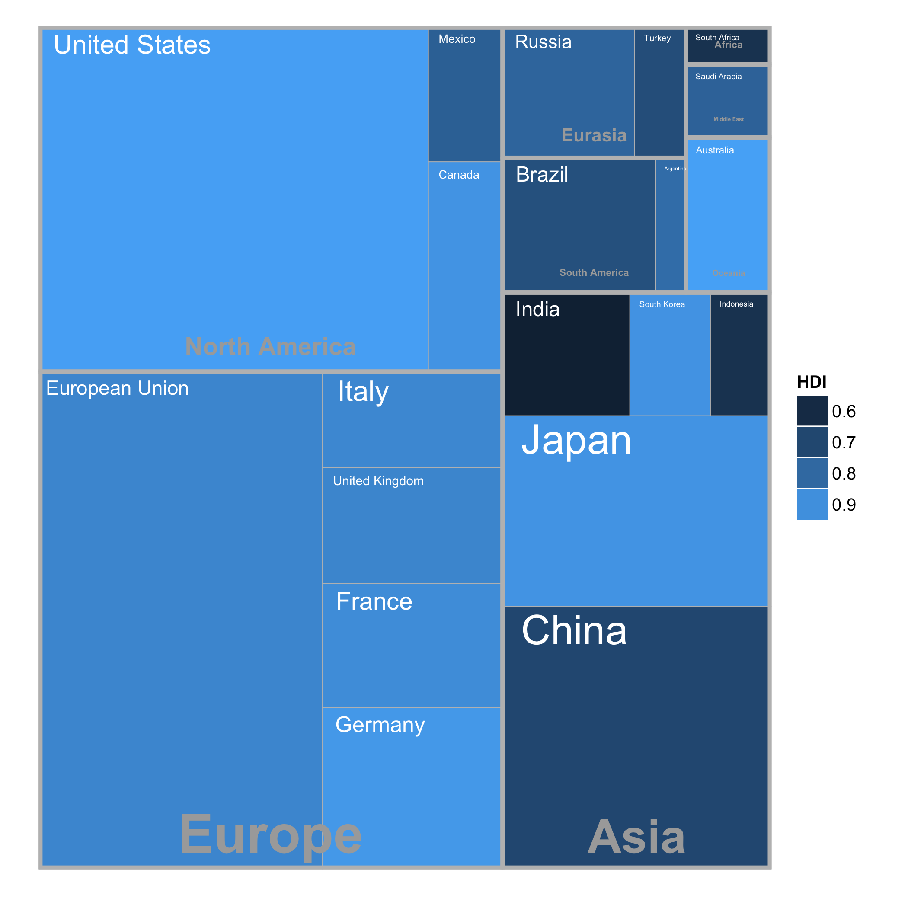
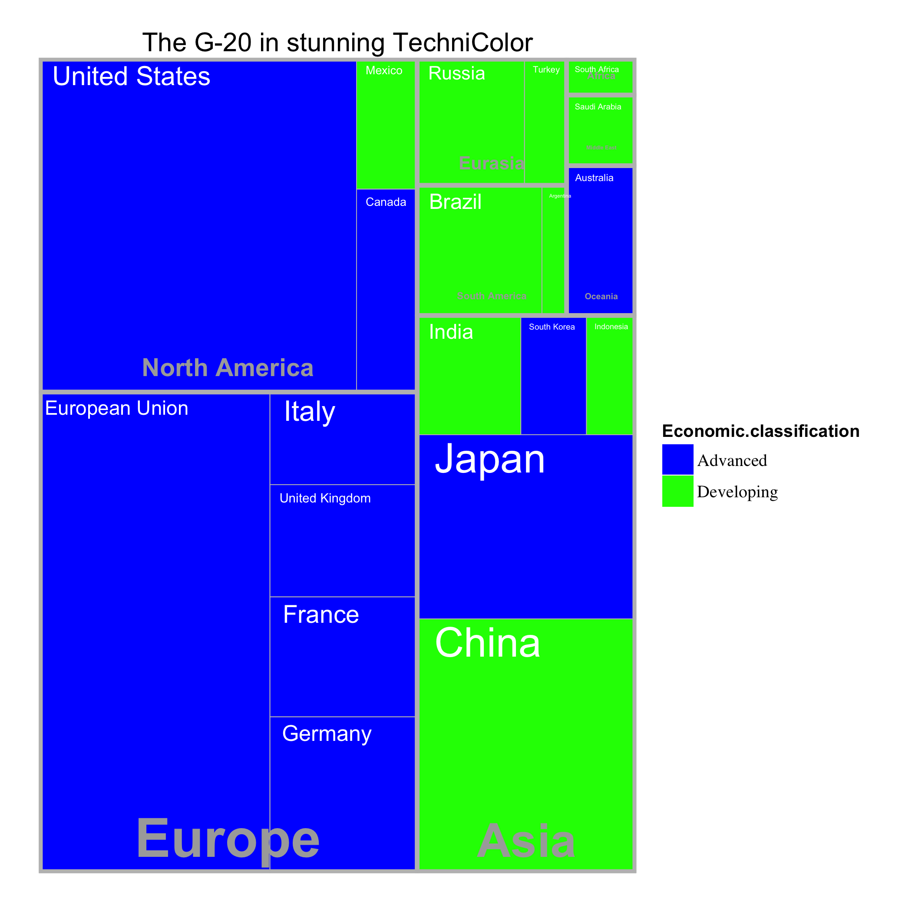

**Treemapify makes it easier to draw [treemaps](http://en.wikipedia.org/wiki/Treemap) with R and ggplot2.**

**2017-03-02 v1.0 released**
- Fixed `ggplotify` bug which caused labels to be drawn with strange alpha
  values.
- `ggplotify` labels are now drawn with geoms provided by `ggfittext`, allowing
  for true fitting of text to rects/groups.
- Several new graphical options for `ggplotify`.
- Fixed bad whitespace in G20 dataset.



# Walkthrough

## Dependencies

Install ggplot2, reshape2, plyr, devtools and ggfittext if you don't have them
already. ggfittext has to be installed from github.

``` r
install.packages("ggplot2")
install.packages("reshape2")
install.packages("plyr")
install.packages("devtools")
library(devtools)
install_github("wilkox/ggfittext")
```

## Install

Install treemapify.

``` r
install_github("wilkox/treemapify")
library(treemapify)
```

## Some example data

For any treemap, you'll need a data frame containing at least the following columns:
- A numeric column, which will determine the area of each treemap rectangle; and
- Another column, either numeric or factor, which will determine the fill colour of each treemap rectangle.

For this example, we'll also use a couple of optional columns:
- A factor column, containing the labels for each rectangle; and
- A factor column, containing group names to group the rectangles.

Let's plot some economic data for the G-20 group of major world economies. The
`G20` data frame comes with treemapify.

``` r
G20
#>           Region        Country Trade.mil.USD Nom.GDP.mil.USD   HDI
#> 1         Africa   South Africa        208000          384315 0.629
#> 2  North America  United States       3969000        15684750 0.937
#> 3  North America         Canada        962600         1819081 0.911
#> 4  North America         Mexico        756800         1177116 0.775
#> 5  South America         Brazil        494800         2395968 0.730
#> 6  South America      Argentina        152690          474954 0.811
#> 7           Asia          China       3801000         8227037 0.699
#> 8           Asia          Japan       1649800         5963969 0.912
#> 9           Asia    South Korea       1068700         1155872 0.909
#> 10          Asia          India        809400         1824832 0.554
#> 11          Asia      Indonesia        384100          878198 0.629
#> 12       Eurasia         Russia        900600         2021960 0.788
#> 13       Eurasia         Turkey        370800          794468 0.722
#> 14        Europe European Union       4567000        16414483 0.876
#> 15        Europe        Germany       2768000         3400579 0.920
#> 16        Europe         France       1226400         2608699 0.893
#> 17        Europe United Kingdom       1127000         2440505 0.875
#> 18        Europe          Italy        953000         2014079 0.881
#> 19   Middle East   Saudi Arabia        518300          727307 0.782
#> 20       Oceania      Australia        522000         1541797 0.938
#>    Population Economic.classification
#> 1    53000000              Developing
#> 2   316173000                Advanced
#> 3    34088000                Advanced
#> 4   112211789              Developing
#> 5   201032714              Developing
#> 6    40117096              Developing
#> 7  1339724852              Developing
#> 8   127390000                Advanced
#> 9    50004441                Advanced
#> 10 1210193422              Developing
#> 11  237556363              Developing
#> 12  143400000              Developing
#> 13   72561312              Developing
#> 14  501259840                Advanced
#> 15   81757600                Advanced
#> 16   65447374                Advanced
#> 17   62041708                Advanced
#> 18   60325805                Advanced
#> 19   27123977              Developing
#> 20   22328632                Advanced
```

## The `treemapify` function

The `treemapify` function generates coordinates for a treemap in which each
observation is represented by a rectangle. In this example, each observation is
a country; the rectangle's area will be mapped to the country's nominal GDP,
while the fill colour will be mapped to the Human Development Index (HDI). We'll
also group the countries by region.

``` r
treeMapCoordinates <- treemapify(
  G20,
  area = "Nom.GDP.mil.USD",
  fill = "HDI",
  label = "Country",
  group = "Region"
)
treeMapCoordinates
#>     fill          label     xmin      xmax     ymin      ymax
#> 1  0.876 European Union  0.00000  38.66972  0.00000  58.99641
#> 2  0.920        Germany 38.66972  63.32079  0.00000  19.17284
#> 3  0.893         France 38.66972  63.32079 19.17284  33.88097
#> 4  0.875 United Kingdom 38.66972  63.32079 33.88097  47.64081
#> 5  0.881          Italy 38.66972  63.32079 47.64081  58.99641
#> 6  0.937  United States  0.00000  53.16491 58.99641 100.00000
#> 7  0.911         Canada 53.16491  63.32079 58.99641  83.89092
#> 8  0.775         Mexico 53.16491  63.32079 83.89092 100.00000
#> 9  0.699          China 63.32079 100.00000  0.00000  31.17403
#> 10 0.912          Japan 63.32079 100.00000 31.17403  53.77280
#> 11 0.554          India 63.32079  80.66598 53.77280  68.39502
#> 12 0.909    South Korea 80.66598  91.65265 53.77280  68.39502
#> 13 0.629      Indonesia 91.65265 100.00000 53.77280  68.39502
#> 14 0.730         Brazil 63.32079  84.19372 68.39502  84.34892
#> 15 0.811      Argentina 84.19372  88.33138 68.39502  84.34892
#> 16 0.788         Russia 63.32079  81.27630 84.34892 100.00000
#> 17 0.722         Turkey 81.27630  88.33138 84.34892 100.00000
#> 18 0.938      Australia 88.33138 100.00000 68.39502  86.75942
#> 19 0.782   Saudi Arabia 88.33138 100.00000 86.75942  95.42241
#> 20 0.629   South Africa 88.33138 100.00000 95.42241 100.00000
#>            group
#> 1         Europe
#> 2         Europe
#> 3         Europe
#> 4         Europe
#> 5         Europe
#> 6  North America
#> 7  North America
#> 8  North America
#> 9           Asia
#> 10          Asia
#> 11          Asia
#> 12          Asia
#> 13          Asia
#> 14 South America
#> 15 South America
#> 16       Eurasia
#> 17       Eurasia
#> 18       Oceania
#> 19   Middle East
#> 20        Africa
```

The ‘xmin’, ‘xmax’, ‘ymin’ and ‘ymax’ columns give the boundaries of each rectangle.

For publication-quality graphics, it's recommended that you stop at this point and use the coordinates to draw your own plot with custom parameters. For quick-and-dirty exploratory graphics, however, treemapify provides an additional helper function.

## The `ggplotify` function

As the name suggests, this function takes output from `treemapify` and produces a [ggplot2](http://ggplot2.org) object containing a graphical layout of the treemap.

``` r
ggplotify(treeMapCoordinates)
```


`ggplotify` uses the `ggfittext` package to scale labels down to fit the rects.
By default, text that is too small to read (< 4pt) will be hidden (in this
example, ‘Argentina’ has been hidden). `ggplotify` provides some options for
customising the way rect and group labels are displayed; for example, the group
label can be blown up to fill the entire group:

``` r
ggplotify(treeMapCoordinates, group.label.type = "fill")
```


There are several graphical options of this sort; read the documentation with
`?ggplotify` for full details.

Because the output of `ggplotify` is a ggplot2 object, you can modify it as you
would any ggplot2 plot, with custom scales and other tweaks.

``` r
treeMapPlot <- ggplotify(treeMapCoordinates)
treeMapPlot <- treeMapPlot + scale_fill_gradient(low = "blue", high = "green",
                                                 guide = "colourbar")
treeMapPlot <- treeMapPlot + theme(legend.position = "bottom")
treeMapPlot <- treeMapPlot + ggtitle("The G-20 in stunning Technicolor")
treeMapPlot
```



For full control over the graphic output, you really should build the ggplot object yourself from the output of `treemapify`.

# Credit

`treemapify` uses the [Squarified Treemap](http://citeseerx.ist.psu.edu/viewdoc/summary?doi=10.1.1.36.6685) algorithm of Mark Bruls, Kees Huizing and Jarke van Wijk.

The G20 dataset is from the Wikipedia article [G-20 major economies](http://en.wikipedia.org/wiki/G-20_major_economies), which is released under the Creative Commons Attribution-Share-Alike License 3.0.
