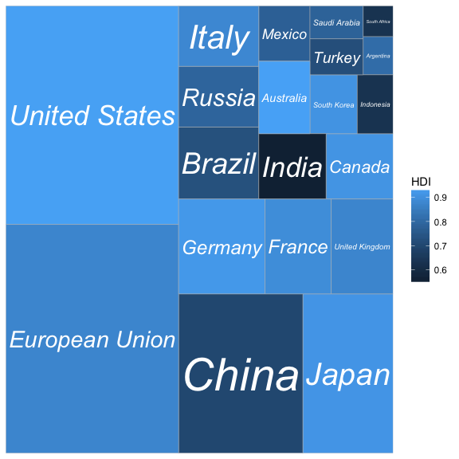

-   [Install](#install)
-   [Example](#example)
-   [Animated treemaps](#animated-treemaps)
-   [Credit](#credit)

**Treemapify provides ggplot2 geoms for drawing [treemaps](http://en.wikipedia.org/wiki/Treemap)**

Install
=======

Install `ggplot2`, `reshape2`, `plyr`, `devtools` and `ggfittext` if you don't have them already. `ggfittext` and `treemapify` are installed from github.

``` r
install.packages("ggplot2")
install.packages("reshape2")
install.packages("plyr")
install.packages("devtools")
library(devtools)
install_github("wilkox/ggfittext")
install_github("wilkox/treemapify")
```

Example
=======

For this example, we'll plot some data on the G-20 group of major world economies. `treemapify` includes this in the `G20` data frame:

``` r
library(treemapify)
G20
```

| Region        | Country        |  GDP.mil.USD|    HDI| Econ.classification |
|:--------------|:---------------|------------:|------:|:--------------------|
| Africa        | South Africa   |       384315|  0.629| Developing          |
| North America | United States  |     15684750|  0.937| Advanced            |
| North America | Canada         |      1819081|  0.911| Advanced            |
| North America | Mexico         |      1177116|  0.775| Developing          |
| South America | Brazil         |      2395968|  0.730| Developing          |
| South America | Argentina      |       474954|  0.811| Developing          |
| Asia          | China          |      8227037|  0.699| Developing          |
| Asia          | Japan          |      5963969|  0.912| Advanced            |
| Asia          | South Korea    |      1155872|  0.909| Advanced            |
| Asia          | India          |      1824832|  0.554| Developing          |
| Asia          | Indonesia      |       878198|  0.629| Developing          |
| Eurasia       | Russia         |      2021960|  0.788| Developing          |
| Eurasia       | Turkey         |       794468|  0.722| Developing          |
| Europe        | European Union |     16414483|  0.876| Advanced            |
| Europe        | Germany        |      3400579|  0.920| Advanced            |
| Europe        | France         |      2608699|  0.893| Advanced            |
| Europe        | United Kingdom |      2440505|  0.875| Advanced            |
| Europe        | Italy          |      2014079|  0.881| Advanced            |
| Middle East   | Saudi Arabia   |       727307|  0.782| Developing          |
| Oceania       | Australia      |      1541797|  0.938| Advanced            |

A treemap has a tile for each observation, with the area of the tile proportional to a variable. Let's start by drawing a treemap with each tile representing a G-20 country. The area of the tile will be mapped to the country's GDP, and the tile's fill colour mapped to its HDI (Human Development Index). `geom_treemap` is the basic geom for this purpose.

``` r
ggplot(G20, aes(area = GDP.mil.USD, fill = HDI)) +
  geom_treemap()
```


This plot isn't very useful without the knowing what country is represented by each tile. `geom_treemap_text` can be used to add a text label to each tile. It uses the [ggfittext](https://github.com/wilkox/ggfittext) package to resize the text so it fits the tile. In addition to standard text formatting aesthetics you would use in `geom_text`, like ‘fontface’ or ‘colour’, we can pass additional options specific for `ggfittext`. For example, we can place the text in the centre of the tile with `place = "centre"`, and expand it to fill as much of the tile as possible with `grow = TRUE`.

``` r
ggplot(G20, aes(area = GDP.mil.USD, fill = HDI, label = Country)) +
  geom_treemap() +
  geom_treemap_text(
    fontface = "italic",
    colour = "white",
    place = "centre",
    grow = TRUE
  )
```



`geom_treemap` supports subgrouping of tiles within a treemap by passing a ‘subgroup’ aesthetic. Let's subgroup the countries by region, draw a border around each subgroup with `geom_treemap_subgroup_border`, and label each subgroup with `geom_treemap_subgroup_text`. As with `geom_treemap_text`, `geom_treemap_subgroup_text` can take `ggfittext` parameters for text placement and sizing.

``` r
ggplot(G20, aes(
  area = GDP.mil.USD,
  fill = HDI,
  label = Country,
  subgroup = Region,
  )) +
  geom_treemap() +
  geom_treemap_subgroup_border() +
  geom_treemap_subgroup_text(
    place = "centre",
    grow = T,
    alpha = 0.5,
    colour = "black",
    fontface = "italic",
    min.size = 0
  ) +
  geom_treemap_text(
    colour = "white",
    place = "topleft",
    reflow = T
  )
```


Note that ‘Argentina’ has been hidden. `geom_treemap_text` will hide text labels that cannot fit a tile without being shrunk below a minimum size, by default 4 points. This can be adjusted with the ‘min.size’ option.

Like any ggplot2 plot, treemapify plots can be faceted, scaled, themed, etc.

``` r
ggplot(G20, aes(area = GDP.mil.USD, fill = Region, label = Country)) +
  geom_treemap() +
  geom_treemap_text(grow = T, reflow = T, colour = "black") +
  facet_wrap( ~ Econ.classification) +
  scale_fill_brewer(palette = "Set1") +
  theme(legend.position = "bottom") +
  labs(
    title = "The G-20 major economies",
    caption = "The area of each country is proportional to its relative GDP
               within the economic group (advanced or developing)",
    fill = "Region"
  )
```


Animated treemaps
=================

All the treemapify treemaps support a ‘fixed’ option that will cause the tiles to be laid out in an order determined by the order of observations in the data frame. While this can result in a less aesthetically pleasing and readable treemap, it allows you to create animated treemaps with the help of the [`tweenr`](https://github.com/thomasp85/tweenr) and [`gganimate`](https://github.com/dgrtwo/gganimate) packages.

``` r
library(tweenr)
library(gganimate)

G20_alt <- G20
G20_alt$GDP.mil.USD <- sample(G20$GDP.mil.USD, nrow(G20))
G20_alt$HDI <- sample(G20$HDI, nrow(G20))

tweened <- tween_states(list(G20, G20_alt, G20), tweenlength = 50, statelength = 25, ease = 'cubic-in-out', nframes = 200)

animated_plot <- ggplot(tweened, aes(
  area = GDP.mil.USD,
  fill = HDI,
  label = Country,
  subgroup = Region,
  frame = .frame
  )) +
  geom_treemap(fixed = T) +
  geom_treemap_subgroup_border(fixed = T) +
  geom_treemap_subgroup_text(
    place = "centre",
    grow = T,
    alpha = 0.5,
    colour = "black",
    fontface = "italic",
    min.size = 0,
    fixed = T
  ) +
  geom_treemap_text(
    colour = "white",
    place = "topleft",
    reflow = T,
    fixed = T
  )

animation::ani.options(interval = 1/15)
gganimate(animated_plot, "animated_treemap.gif", title_frame = F, ani.width = 400, ani.height = 400)
```


Credit
======

`treemapify` uses the [Squarified Treemap](http://citeseerx.ist.psu.edu/viewdoc/summary?doi=10.1.1.36.6685) algorithm of Mark Bruls, Kees Huizing and Jarke van Wijk.

The G20 dataset is from the Wikipedia article [G-20 major economies](http://en.wikipedia.org/wiki/G-20_major_economies), which is released under the Creative Commons Attribution-Share-Alike License 3.0.
