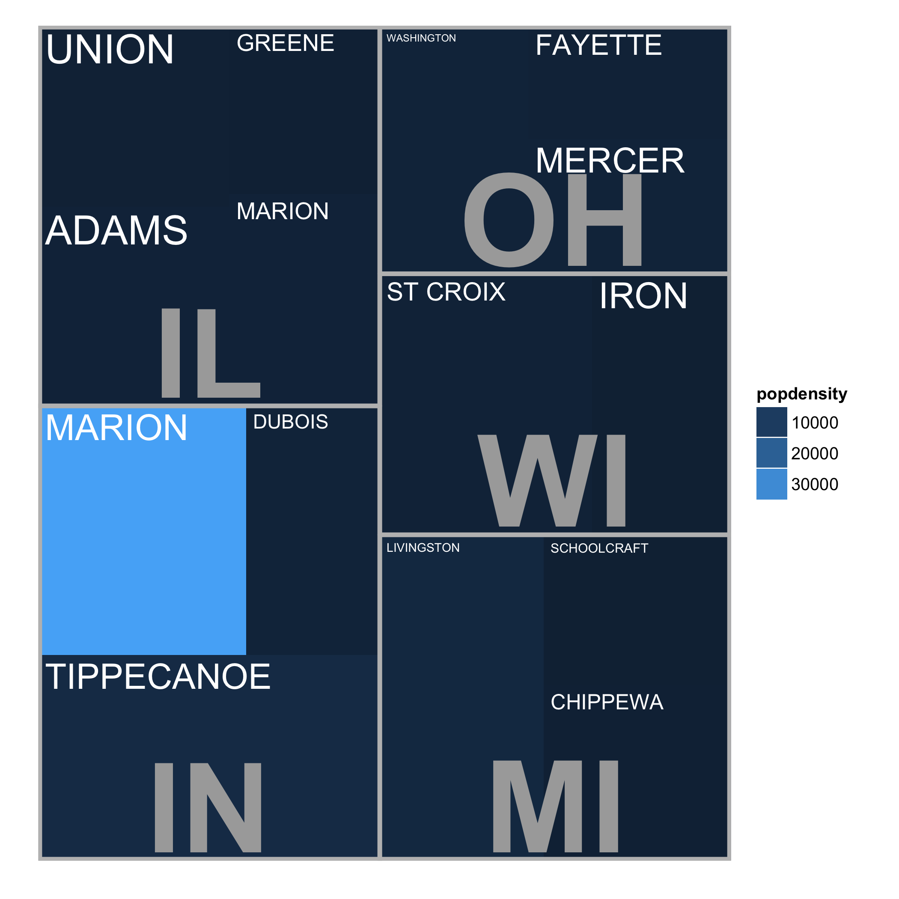

#Note to anybody stumbling across this repo

This README is a work in progress. The treemapify code pretty much works though. Go ahead and try it out.

#TODO
- Finish walkthrough (need better example data)
- Credit squarify paper
- Full description of function options
- Thin lines between rects

---

Treemapify helps you draw treemaps.

---

#Walkthrough

##Installing dependancies, sourcing treemapify

- Install ggplot2, plyr and devtools if you don't have them already.

```R
install.packages("ggplot2")
install.packages("plyr")
install.packages("devtools")
```

- Source the treemapify functions.

```R
library(devtools)
source_url("https://raw.github.com/wilkox/treemapify/master/treemapify.R")
```

##Some example data

For any treemap, you'll need a data frame containing at least the following columns:
  - A numeric column, which will determine the area of each treemap rectangle; and
  - Another numeric column, which will determine the fill colour of each treemap rectangle.

For this example, we'll also use a couple of optional columns:
  - A factor column, containing the labels for each rectangle; and
  - A factor column, containg group names to group the rectangles.

Let's make a treemap of oesophageal cancer deaths, broken down by age group and alcohol consumption.

```R
> midwestData <- midwest[c("county", "state", "popdensity", "percollege")][seq(1, 437, 30), ]
> midwestData$county <- as.factor(midwestData$county)
> midwestData$state <- as.factor(midwestData$state)
> midwestData
county state popdensity percollege
1         ADAMS    IL  1270.9615   19.63139
31       GREENE    IL   464.1515   13.04955
61       MARION    IL  1187.4571   16.44939
91        UNION    IL   734.1250   17.87959
121      DUBOIS    IN  1408.3077   17.16766
151      MARION    IN 34659.0870   26.74469
181  TIPPECANOE    IN  4353.2667   36.24544
211    CHIPPEWA    MI   443.6410   16.93977
241  LIVINGSTON    MI  3401.3235   27.58664
271 SCHOOLCRAFT    MI   110.6933   14.56672
301     FAYETTE    OH  1144.4167   11.87409
331      MERCER    OH  1408.6786   14.10008
361  WASHINGTON    OH  1638.2632   19.00968
391        IRON    WI   130.9149   18.73173
421    ST CROIX    WI  1142.0682   28.58809
```

##The `treemapify` function

The `treemapify` function takes a data frame and generates coordinates for a treemap where each observation is represented by a rectangle. In this example, each observation is a county; the rectangle's area will be mapped to the percentage of residents with college degrees, while the fill colour will be mapped to population density. We'll also group the counties by state.

```R
> treeMapCoordinates <- treemapify(midwestData, area="percollege", fill="popdensity", label="county", group="state")
> treeMapCoordinates
area       fill       label     xmin      xmax     ymin      ymax
1   575.0068  1408.3077      DUBOIS 30.02100  49.29176 24.62867  54.46697
2   895.7759 34659.0870      MARION  0.00000  30.02100 24.62867  54.46697
3  1213.9904  4353.2667  TIPPECANOE  0.00000  49.29176  0.00000  24.62867
4   657.5260  1270.9615       ADAMS  0.00000  27.59267 54.46697  78.29671
5   437.0763   464.1515      GREENE 27.59267  49.29176 79.85739 100.00000
6   550.9491  1187.4571      MARION 27.59267  49.29176 54.46697  79.85739
7   598.8518   734.1250       UNION  0.00000  27.59267 78.29671 100.00000
8   567.3737   443.6410    CHIPPEWA 72.96406 100.00000  0.00000  20.98591
9   923.9758  3401.3235  LIVINGSTON 49.29176  72.96406  0.00000  39.03195
10  487.8919   110.6933 SCHOOLCRAFT 72.96406 100.00000 20.98591  39.03195
11  627.3931   130.9149        IRON 79.92695 100.00000 39.03195  70.28745
12  957.5180  1142.0682    ST CROIX 49.29176  79.92695 39.03195  70.28745
13  397.7060  1144.4167     FAYETTE 70.72050 100.00000 86.41691 100.00000
14  472.2626  1408.6786      MERCER 70.72050 100.00000 70.28745  86.41691
15  636.7025  1638.2632  WASHINGTON 49.29176  70.72050 70.28745 100.00000
labelx   labely labelsize group
1  31.02100 53.46697  3.211793    IN
2   1.00000 53.46697  5.003501    IN
3   1.00000 23.62867  4.929176    IN
4   1.00000 77.29671  5.518534    IL
5  28.59267 99.00000  3.616516    IL
6  28.59267 78.85739  3.616516    IL
7   1.00000 99.00000  5.518534    IL
8  73.96406 19.98591  3.379493    MI
9  50.29176 38.03195  2.367229    MI
10 73.96406 38.03195  2.457813    MI
11 80.92695 69.28745  5.018262    WI
12 50.29176 69.28745  3.829398    WI
13 71.72050 99.00000  4.182785    OH
14 71.72050 85.41691  4.879916    OH
15 50.29176 99.00000  2.142874    OH
```

The "xmin", "xmax", "ymin" and "ymax" columns give the boundaries of each rectangle. Note that the funciont has also provided coordinates and sizes for text labels for each observation.

For publication-quality graphics, it's recommended that you stop at this point and use the coordinates provided to draw your own plot with custom parameters. For quick-and-dirty exploratory graphics, however, treemapify provides an additional function to draw the treemap with ggplot2.

##The `ggplotify` function

As the name suggests, this function takes a data frame of treemap coordinates produced by `treemapify` and produces a ggplot object containing a graphical layout of the treemap.

```R
> treeMapPlot <- ggplotify(treeMapCoordinates)
> print(treeMapPlot)
```


